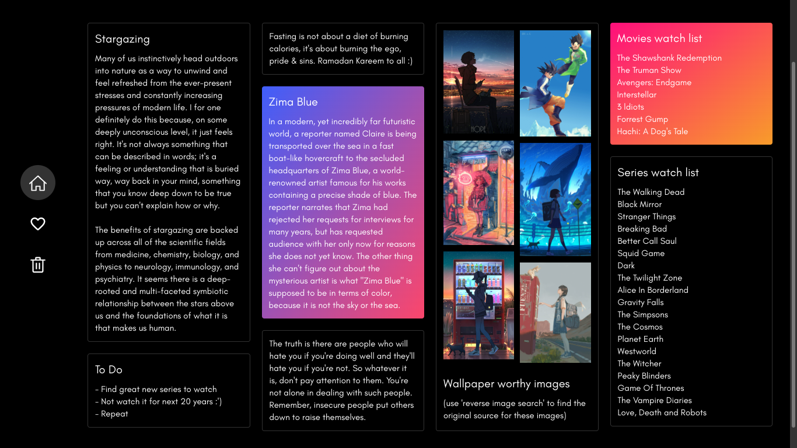
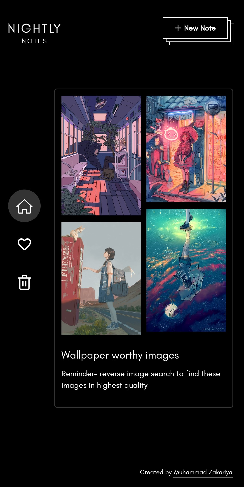
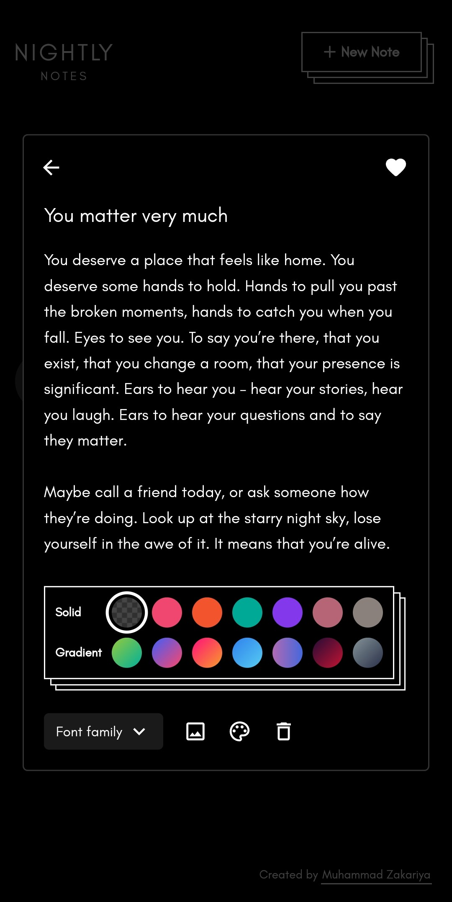
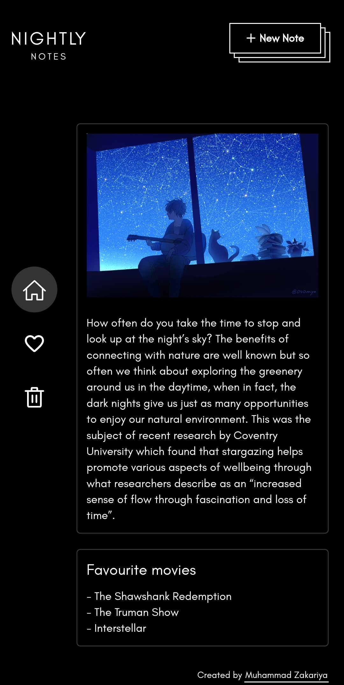

# **Nightly Notes (React)**

A notes app [originally](https://github.com/zakariyaq313/nightly-notes-vue) made using Vue, re-made completely using React! 🤩

**Screenshot -**

**Mobile screenshots -**

	
	 
	

**Made using -**

- React + Typescript
- Sass / SCSS
- Redux Toolkit
- React Router
- Icons are custom made (by picking icons from Material-Icons in the form of SVG, and converting them into JSX components using this website - https://svg2jsx.com/)
- **No additional libraries used**

**Notes -**

Few months prior to beginning this project, I had created a notes app using Vue. It was an extensive project, and I put a lot of effort into making it. Now, to test and showcase my newly picked up React skills, I wanted to create a similarly comprehensive application. Instead of trying a different project idea, I decided to re-create this same notes app using React and Typescript. One reason for this decision was, creating a **good** original design is difficult for me because I'm not a designer. It took me quite some time until I made it for the Vue version of this app. More about that [here](./src/README.md). Then, writing detailed styles further takes even more time. So doing this process all over again for a new app seemed exhausting. Therefore, I decided to re-use all the ready made styles and design from the previous app, and focus solely on the app structure and logic. Another reason was, of course, the exciting premise of bringing React and Vue head to head!

Ultimately, this decision proved very beneficial to me. Over the course of this project, I was able to see the differences and similarities between React and Vue first-hand, which helped me understand them more closely. I would often draw comparisons between something I implemented in React and how I originally did it in Vue. This helped me see flaws in my logic, and I was able to overcome and improve upon many of the mistakes I made in Vue version of the app. Functionally, both the apps look and behave exactly the same, though in the end, their internal structure and logic turned out to be quite different :)

**How to run in local server -**
- `Clone` the respository
- `npm install` - To install project dependencies
- `npm start` - To start the development server
