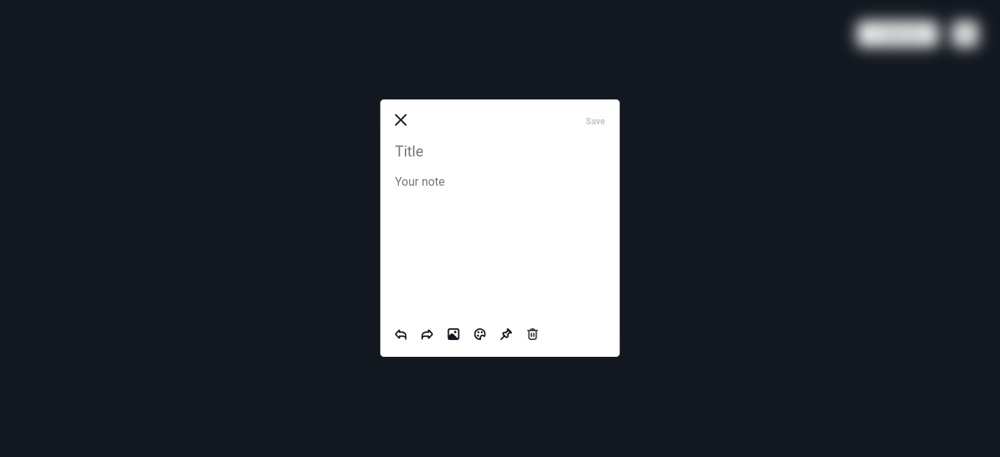
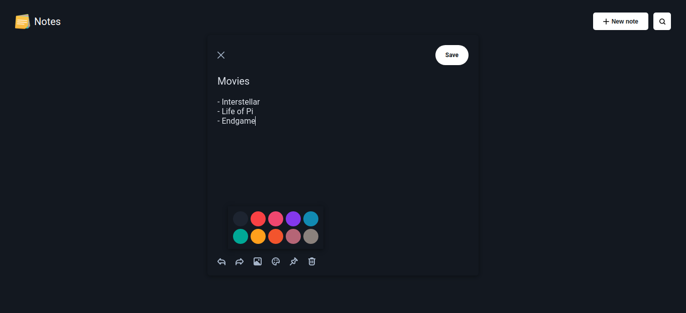
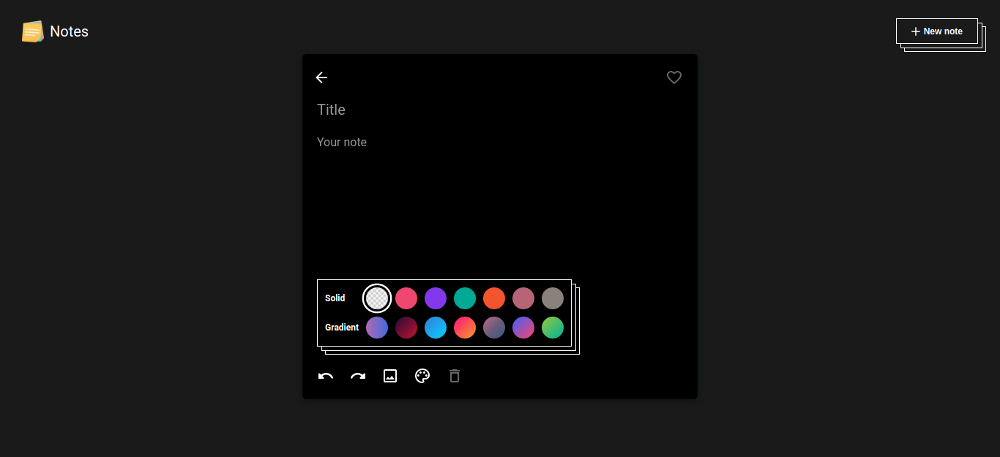
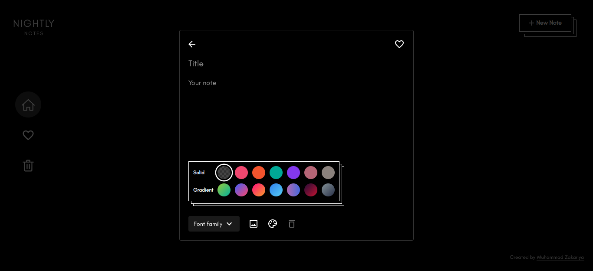

# **Design progression**

(I only created one original design and it was for Vue version of the app. Hence this progression is from the time of previous app's development)

**First iteration -**

**Second iteration -**

**Third iteration -**

**Fourth iteration -**

 

**Notes -**

This app was inspired by Google Keep, but I did not intend to make a one-to-one clone of it. Instead I wanted to create a notes app which resembled Google Keep but had a distinct design and theme of its own. When I implemented the design idea of my mind in the `First iteration`, it felt mediocre and very underwhelming. I had already added substantial logic to the app, and I knew the idea of notes app as a project was compelling, but with the result that I got, I was disappointed. I was considering shelving the project altogether, but because I had already put a lot of work, I gave it another chance. Then I reached `Second Iteration`. Just a change in the background color and added shadow to the note dialog breathed a new life into the design! It felt promising and worthwhile, and I got my interest back in the project. The `Third Iteration` was a step up to the next level, it just felt a little incomplete somehow. I could see the little bits of elegance here and there, I simply needed to put it all together. Some small changes in overall styles and a new font family, and I had reached the `Fourth iteration` :)